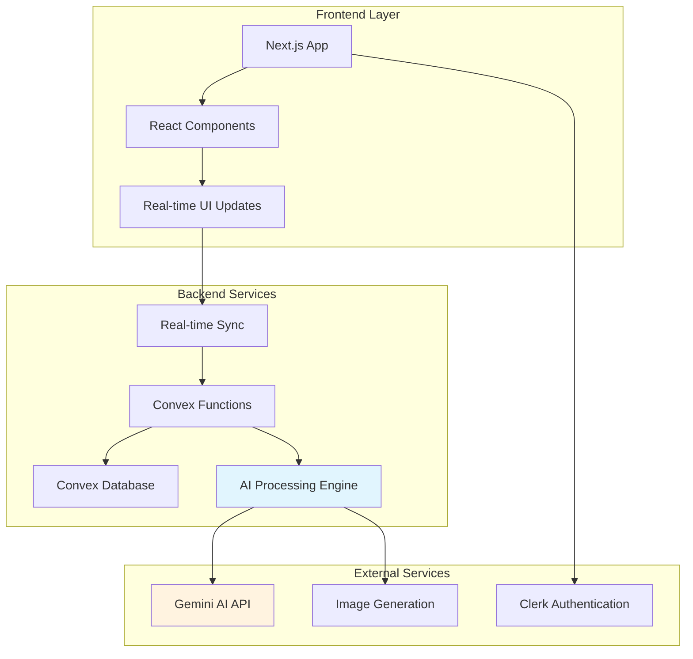
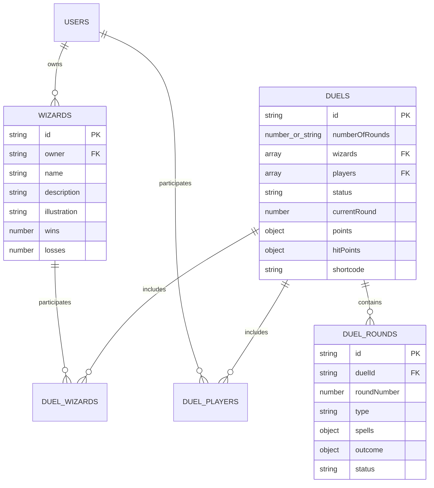
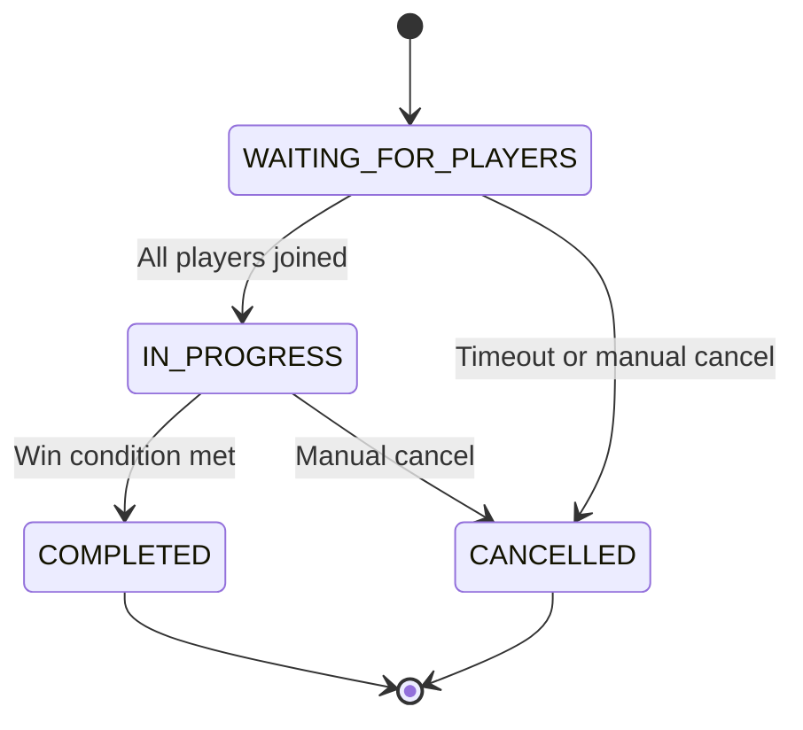
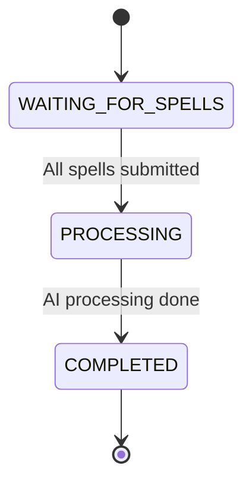

# Design Document

## Overview

The AI Wizard Duel system is a turn-based multiplayer game where players create wizard characters and engage in magical combat. The system leverages AI to generate narrative descriptions of combat rounds, award points for creativity and effectiveness, and manage health point tracking. The architecture builds upon the existing Convex backend with real-time synchronization, AI integration through Gemini, and a Next.js frontend.

The system supports both fixed-round duels and "to the death" battles, with comprehensive scoring that rewards strategic thinking, creativity, and magical complexity. Real-time updates ensure both players experience synchronized gameplay with immediate feedback on opponent actions and round outcomes.

## Architecture

### High-Level Architecture



### Data Flow Architecture

The system follows an event-driven architecture where user actions trigger cascading updates through the system:

1. **Action Submission**: Players submit spell actions through the frontend
2. **Validation & Storage**: Actions are validated and stored in the database
3. **Round Processing**: When both players have acted, AI processing begins
4. **Narrative Generation**: AI generates combat narrative and scoring
5. **State Updates**: Game state is updated with results
6. **Real-time Sync**: All clients receive immediate updates
7. **Next Round**: System prepares for the next round or concludes the duel

### Technology Stack

- **Frontend**: Next.js 14, React, TypeScript, Tailwind CSS
- **Backend**: Convex (serverless functions and database)
- **AI Services**: Google Gemini Flash for text generation
- **Authentication**: Clerk
- **Real-time**: Convex built-in real-time subscriptions
- **Image Generation**: Integrated AI image generation for illustrations

## Components and Interfaces

### Core Data Models

#### Wizard Model

```typescript
interface Wizard {
  _id: Id<"wizards">;
  owner: string; // Clerk user ID
  name: string;
  description: string;
  illustrationURL?: string;
  illustration?: string; // Convex storage ID
  illustrationGeneratedAt?: number;
  illustrationVersion?: number;
  illustrations?: string[]; // Array of storage IDs
  isAIPowered?: boolean;
  wins?: number;
  losses?: number;
}
```

#### Duel Model

```typescript
interface Duel {
  _id: Id<"duels">;
  numberOfRounds: number | "TO_THE_DEATH";
  wizards: Id<"wizards">[];
  players: string[]; // User IDs
  status: "WAITING_FOR_PLAYERS" | "IN_PROGRESS" | "COMPLETED" | "CANCELLED";
  currentRound: number;
  createdAt: number;
  points: Record<string, number>; // Wizard ID to points
  hitPoints: Record<string, number>; // Wizard ID to hit points
  needActionsFrom: Id<"wizards">[];
  sessionId?: string;
  featuredIllustration?: string;
  winners?: Id<"wizards">[];
  losers?: Id<"wizards">[];
  shortcode?: string; // 6-character join code
}
```

#### Duel Round Model

```typescript
interface DuelRound {
  _id: Id<"duelRounds">;
  duelId: Id<"duels">;
  roundNumber: number;
  type: "SPELL_CASTING" | "COUNTER_SPELL" | "FINAL_ROUND" | "CONCLUSION";
  spells?: Record<
    string,
    {
      description: string;
      castBy: Id<"wizards">;
      timestamp: number;
    }
  >;
  outcome?: {
    narrative: string;
    result?: string;
    illustration?: string;
    illustrationPrompt?: string;
    pointsAwarded?: Record<string, number>;
    healthChange?: Record<string, number>;
  };
  status: "WAITING_FOR_SPELLS" | "PROCESSING" | "COMPLETED";
}
```

### Frontend Components

#### Duel Management Components

- **CreateDuelForm**: Handles duel creation with wizard selection and round configuration
- **JoinDuelForm**: Allows players to join existing duels via shortcode
- **DuelLobby**: Displays waiting room for players before duel starts

#### Combat Interface Components

- **CastSpellModal**: Primary interface for submitting spell actions
- **DuelRoundCard**: Displays individual round results with narrative and scoring
- **DuelProgress**: Shows current round, scores, and health status
- **WizardStatusCard**: Displays wizard health, points, and current state

#### Wizard Management Components

- **CreateWizardForm**: Wizard creation interface
- **EditWizardForm**: Wizard modification interface
- **WizardCard**: Display component for wizard information
- **WizardGallery**: Grid view of user's wizards

### Backend Services

#### Duel Management Service

```typescript
// Core duel operations
- createDuel(numberOfRounds, wizards, players, sessionId?)
- joinDuel(duelId, userId, wizards)
- startDuel(duelId)
- getDuel(duelId)
- getDuelByShortcode(shortcode)
- cancelDuel(duelId)
```

#### Combat Processing Service

```typescript
// Round processing and AI integration
-castSpell(duelId, wizardId, spellDescription) -
  processDuelRound(duelId, roundId) -
  completeRound(roundId, outcome) -
  generateBattleRound(duel, round, wizard1, wizard2);
```

#### Wizard Management Service

```typescript
// Wizard CRUD operations
-createWizard(owner, name, description) -
  updateWizard(wizardId, updates) -
  getUserWizards(userId) -
  updateWizardStats(wizardId, won) -
  regenerateIllustration(wizardId);
```

### AI Processing Engine

#### Battle Resolution System

The AI processing engine uses a sophisticated prompt system to generate combat narratives:

**System Prompt Components**:

- Magical principles and laws governing spell interactions
- Evaluation criteria for creativity, strategy, and effectiveness
- Environmental factors and arena dynamics
- Luck factor integration (1-10 scale per wizard)
- Response format specification (JSON structure)

**Processing Pipeline**:

1. **Input Validation**: Sanitize and validate spell actions
2. **Context Building**: Compile wizard data, current state, and round information
3. **AI Generation**: Send structured prompt to Gemini AI
4. **Response Parsing**: Parse and validate JSON response
5. **Bounds Checking**: Ensure points (0-10) and health changes (-100 to +100) are within limits
6. **Fallback Handling**: Generate deterministic results if AI fails

#### Scoring Algorithm

Points are awarded based on multiple criteria:

- **Creativity & Strategy** (0-4 points): Originality and tactical thinking
- **Magical Complexity** (0-3 points): Technical difficulty and skill
- **Defensive Considerations** (0-2 points): Protection and counter-measures
- **Environmental Awareness** (0-1 points): Arena utilization
- **Luck Modifier**: Influences success probability without explicit mention

## Data Models

### Database Schema Extensions

The existing schema supports the core functionality with these key relationships:



### State Management

#### Duel State Machine



#### Round State Machine



### Real-time Data Synchronization

The system uses Convex's built-in real-time capabilities to ensure synchronized gameplay:

- **Duel State Updates**: Automatic propagation of status changes
- **Action Notifications**: Immediate feedback when opponents act
- **Round Results**: Synchronized display of AI-generated narratives
- **Health/Score Updates**: Real-time point and health tracking
- **Connection Handling**: Automatic reconnection and state sync

## Error Handling

### AI Processing Failures

- **Fallback Generation**: Deterministic combat resolution when AI fails
- **Retry Logic**: Automatic retry with exponential backoff
- **Graceful Degradation**: Continue gameplay with simplified narratives
- **Error Logging**: Comprehensive logging for debugging and monitoring

### Network and Connectivity

- **Offline Handling**: Queue actions for when connection resumes
- **Timeout Management**: Automatic default actions for inactive players
- **State Recovery**: Automatic state synchronization on reconnection
- **Conflict Resolution**: Handle simultaneous action submissions

### Data Validation

- **Input Sanitization**: Prevent malicious or invalid spell descriptions
- **Bounds Checking**: Ensure all numeric values stay within valid ranges
- **Schema Validation**: Strict type checking for all data operations
- **Rate Limiting**: Prevent spam and abuse of the system

## Testing Strategy

### Unit Testing

- **AI Processing Logic**: Mock AI responses and test parsing/validation
- **Combat Resolution**: Test scoring algorithms and health calculations
- **State Transitions**: Verify correct duel and round state changes
- **Data Validation**: Test input sanitization and bounds checking

### Integration Testing

- **End-to-End Duel Flow**: Complete duel from creation to conclusion
- **Real-time Synchronization**: Multi-client state consistency
- **AI Service Integration**: Test with actual AI service responses
- **Error Recovery**: Test fallback mechanisms and error handling

### Performance Testing

- **Concurrent Duels**: Test system under multiple simultaneous duels
- **AI Response Times**: Monitor and optimize AI processing latency
- **Database Performance**: Test query performance under load
- **Real-time Updates**: Measure synchronization latency

### User Experience Testing

- **Responsive Design**: Test across different screen sizes and devices
- **Accessibility**: Ensure compliance with accessibility standards
- **User Flow**: Test complete user journeys from wizard creation to duel completion
- **Error Messages**: Verify clear and helpful error communication

## Security Considerations

### Authentication and Authorization

- **User Verification**: Clerk integration for secure user authentication
- **Wizard Ownership**: Ensure users can only control their own wizards
- **Duel Participation**: Verify user authorization for duel actions
- **Admin Functions**: Restrict administrative operations to authorized users

### Input Validation and Sanitization

- **Spell Action Filtering**: Prevent inappropriate content in spell descriptions
- **XSS Prevention**: Sanitize all user-generated content
- **SQL Injection**: Use parameterized queries and ORM protection
- **Rate Limiting**: Prevent abuse through action throttling

### Data Protection

- **Personal Information**: Minimize collection and secure storage of user data
- **Game State Integrity**: Prevent manipulation of scores and health points
- **Audit Logging**: Track all significant game actions for debugging and security
- **Backup and Recovery**: Regular backups of critical game data

This design provides a robust foundation for the AI Wizard Duel system, leveraging existing infrastructure while adding sophisticated AI-powered gameplay mechanics and real-time multiplayer functionality.
