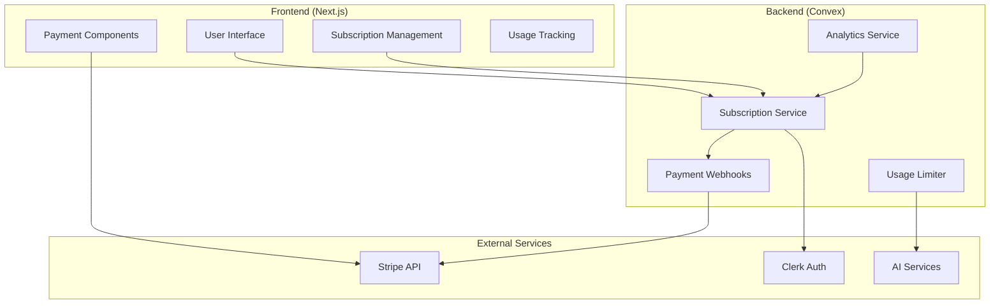

# Monetization System Design Document

## Overview

This document outlines the technical design for implementing a comprehensive monetization system in the AI Wizard Duel application. The system will support freemium subscriptions, usage-based limitations, premium features, cosmetic purchases, tournament entry fees, and AI generation credits.

The design leverages Stripe for payment processing, extends the existing Convex database schema, and integrates seamlessly with the current Clerk authentication system.

## Architecture

### High-Level Architecture



### Data Flow

1. **User Registration**: New users get free tier by default
2. **Usage Tracking**: All actions are tracked against user limits
3. **Upgrade Flow**: Users can upgrade through Stripe Checkout
4. **Webhook Processing**: Stripe webhooks update subscription status
5. **Feature Gating**: Services check user tier before allowing actions

## Components and Interfaces

### Database Schema Extensions

#### Users Table (New)

```typescript
users: defineTable({
  clerkId: v.string(), // Links to Clerk user
  subscriptionTier: v.union(v.literal("FREE"), v.literal("PREMIUM")),
  subscriptionStatus: v.union(
    v.literal("ACTIVE"),
    v.literal("CANCELED"),
    v.literal("PAST_DUE"),
    v.literal("TRIALING")
  ),
  stripeCustomerId: v.optional(v.string()),
  stripeSubscriptionId: v.optional(v.string()),
  subscriptionEndsAt: v.optional(v.number()),
  aiCredits: v.number(), // Remaining AI generation credits
  monthlyUsage: v.object({
    duelsPlayed: v.number(),
    wizardsCreated: v.number(),
    aiGenerations: v.number(),
    resetDate: v.number(), // When usage resets
  }),
  createdAt: v.number(),
  updatedAt: v.number(),
})
  .index("by_clerk_id", ["clerkId"])
  .index("by_stripe_customer", ["stripeCustomerId"]);
```

#### Cosmetic Items Table (New)

```typescript
cosmeticItems: defineTable({
  name: v.string(),
  description: v.string(),
  category: v.union(
    v.literal("SPELL_EFFECT"),
    v.literal("WIZARD_ACCESSORY"),
    v.literal("BACKGROUND"),
    v.literal("ANIMATION")
  ),
  price: v.number(), // Price in cents
  rarity: v.union(
    v.literal("COMMON"),
    v.literal("RARE"),
    v.literal("EPIC"),
    v.literal("LEGENDARY")
  ),
  previewImage: v.optional(v.string()),
  isActive: v.boolean(),
  premiumOnly: v.boolean(),
});
```

#### User Inventory Table (New)

```typescript
userInventory: defineTable({
  userId: v.string(), // Clerk ID
  itemId: v.id("cosmeticItems"),
  purchasedAt: v.number(),
  equipped: v.boolean(),
})
  .index("by_user", ["userId"])
  .index("by_user_item", ["userId", "itemId"]);
```

#### Tournaments Table (New)

```typescript
tournaments: defineTable({
  name: v.string(),
  description: v.string(),
  entryFee: v.number(), // In cents, 0 for free tournaments
  prizePool: v.number(), // In cents
  maxParticipants: v.number(),
  startDate: v.number(),
  endDate: v.number(),
  status: v.union(
    v.literal("UPCOMING"),
    v.literal("ACTIVE"),
    v.literal("COMPLETED"),
    v.literal("CANCELLED")
  ),
  participants: v.array(v.string()), // User IDs
  winners: v.optional(
    v.array(
      v.object({
        userId: v.string(),
        position: v.number(),
        prize: v.number(),
      })
    )
  ),
});
```

#### Transactions Table (New)

```typescript
transactions: defineTable({
  userId: v.string(),
  type: v.union(
    v.literal("SUBSCRIPTION"),
    v.literal("COSMETIC_PURCHASE"),
    v.literal("TOURNAMENT_ENTRY"),
    v.literal("AI_CREDITS"),
    v.literal("TOURNAMENT_PRIZE")
  ),
  amount: v.number(), // In cents
  stripePaymentIntentId: v.optional(v.string()),
  status: v.union(
    v.literal("PENDING"),
    v.literal("COMPLETED"),
    v.literal("FAILED"),
    v.literal("REFUNDED")
  ),
  metadata: v.optional(v.record(v.string(), v.any())),
  createdAt: v.number(),
})
  .index("by_user", ["userId"])
  .index("by_stripe_payment", ["stripePaymentIntentId"]);
```

### Core Services

#### Subscription Service

```typescript
interface SubscriptionService {
  // User management
  createUser(clerkId: string): Promise<User>;
  getUser(clerkId: string): Promise<User | null>;
  updateSubscription(userId: string, tier: SubscriptionTier): Promise<void>;

  // Usage tracking
  checkUsageLimit(userId: string, action: UsageAction): Promise<boolean>;
  incrementUsage(userId: string, action: UsageAction): Promise<void>;
  resetMonthlyUsage(userId: string): Promise<void>;

  // Feature access
  hasFeatureAccess(userId: string, feature: PremiumFeature): Promise<boolean>;
  getAIModelTier(userId: string): Promise<AIModelTier>;
}
```

#### Payment Service

```typescript
interface PaymentService {
  // Subscription management
  createCheckoutSession(userId: string, priceId: string): Promise<string>;
  createPortalSession(customerId: string): Promise<string>;

  // One-time purchases
  purchaseCosmetic(userId: string, itemId: string): Promise<Transaction>;
  purchaseAICredits(
    userId: string,
    creditPackage: CreditPackage
  ): Promise<Transaction>;

  // Tournament payments
  enterTournament(userId: string, tournamentId: string): Promise<Transaction>;
  distributePrizes(tournamentId: string): Promise<void>;
}
```

#### Usage Limiter Service

```typescript
interface UsageLimiterService {
  // Limit definitions
  FREE_WIZARD_LIMIT: 2;
  FREE_DAILY_DUELS: 5;
  FREE_MONTHLY_AI_CREDITS: 10;

  // Validation methods
  canCreateWizard(userId: string): Promise<boolean>;
  canStartDuel(userId: string): Promise<boolean>;
  canUseAI(userId: string, creditsRequired: number): Promise<boolean>;

  // Usage tracking
  trackWizardCreation(userId: string): Promise<void>;
  trackDuelParticipation(userId: string): Promise<void>;
  trackAIUsage(userId: string, creditsUsed: number): Promise<void>;
}
```

### Frontend Components

#### Subscription Management Component

```typescript
interface SubscriptionManagerProps {
  currentTier: SubscriptionTier;
  usage: MonthlyUsage;
  onUpgrade: () => void;
  onManageBilling: () => void;
}

const SubscriptionManager: React.FC<SubscriptionManagerProps>;
```

#### Usage Display Component

```typescript
interface UsageDisplayProps {
  usage: MonthlyUsage;
  limits: UsageLimits;
  tier: SubscriptionTier;
}

const UsageDisplay: React.FC<UsageDisplayProps>;
```

#### Cosmetic Shop Component

```typescript
interface CosmeticShopProps {
  items: CosmeticItem[];
  userInventory: UserInventory[];
  onPurchase: (itemId: string) => void;
}

const CosmeticShop: React.FC<CosmeticShopProps>;
```

## Data Models

### User Subscription Model

```typescript
interface User {
  _id: Id<"users">;
  clerkId: string;
  subscriptionTier: "FREE" | "PREMIUM";
  subscriptionStatus: "ACTIVE" | "CANCELED" | "PAST_DUE" | "TRIALING";
  stripeCustomerId?: string;
  stripeSubscriptionId?: string;
  subscriptionEndsAt?: number;
  aiCredits: number;
  monthlyUsage: {
    duelsPlayed: number;
    wizardsCreated: number;
    aiGenerations: number;
    resetDate: number;
  };
  createdAt: number;
  updatedAt: number;
}
```

### Cosmetic Item Model

```typescript
interface CosmeticItem {
  _id: Id<"cosmeticItems">;
  name: string;
  description: string;
  category: "SPELL_EFFECT" | "WIZARD_ACCESSORY" | "BACKGROUND" | "ANIMATION";
  price: number;
  rarity: "COMMON" | "RARE" | "EPIC" | "LEGENDARY";
  previewImage?: string;
  isActive: boolean;
  premiumOnly: boolean;
}
```

### Tournament Model

```typescript
interface Tournament {
  _id: Id<"tournaments">;
  name: string;
  description: string;
  entryFee: number;
  prizePool: number;
  maxParticipants: number;
  startDate: number;
  endDate: number;
  status: "UPCOMING" | "ACTIVE" | "COMPLETED" | "CANCELLED";
  participants: string[];
  winners?: Array<{
    userId: string;
    position: number;
    prize: number;
  }>;
}
```

## Error Handling

### Payment Errors

- **Insufficient Funds**: Display user-friendly message with alternative payment methods
- **Card Declined**: Provide clear instructions for resolving payment issues
- **Webhook Failures**: Implement retry logic with exponential backoff
- **Subscription Sync Issues**: Background jobs to reconcile Stripe and database state

### Usage Limit Errors

- **Limit Exceeded**: Show upgrade prompts with clear value propositions
- **Rate Limiting**: Implement graceful degradation with informative messages
- **Feature Access Denied**: Redirect to subscription management with context

### Data Consistency

- **Transaction Rollbacks**: Ensure atomic operations for critical payment flows
- **Eventual Consistency**: Handle temporary inconsistencies between services
- **Audit Logging**: Track all monetization-related actions for debugging

## Testing Strategy

### Unit Tests

- **Subscription Service**: Test tier changes, usage tracking, feature access
- **Payment Service**: Mock Stripe interactions, test transaction flows
- **Usage Limiter**: Verify limit enforcement and usage calculations
- **Frontend Components**: Test subscription UI states and user interactions

### Integration Tests

- **Stripe Webhooks**: Test webhook processing with Stripe test events
- **Database Operations**: Verify data consistency across related tables
- **Authentication Flow**: Test subscription access with Clerk integration
- **AI Service Integration**: Test credit deduction and model tier selection

### End-to-End Tests

- **Subscription Flow**: Complete user journey from free to premium
- **Purchase Flow**: Test cosmetic purchases and tournament entries
- **Usage Limits**: Verify enforcement across different user tiers
- **Billing Management**: Test subscription changes and cancellations

### Performance Tests

- **Usage Tracking**: Ensure minimal latency impact on core features
- **Database Queries**: Optimize subscription and usage queries
- **Webhook Processing**: Test high-volume webhook handling
- **Payment Processing**: Verify response times for payment operations

## Security Considerations

### Payment Security

- **PCI Compliance**: Use Stripe Elements for secure card collection
- **Webhook Verification**: Validate all Stripe webhook signatures
- **API Key Management**: Secure storage of Stripe API keys
- **Transaction Validation**: Server-side verification of all payments

### Access Control

- **Feature Gating**: Server-side enforcement of subscription tiers
- **Usage Validation**: Prevent client-side manipulation of usage limits
- **Admin Functions**: Restrict administrative monetization functions
- **Audit Trails**: Log all subscription and payment changes

### Data Protection

- **PII Handling**: Minimize storage of payment-related personal data
- **Encryption**: Encrypt sensitive subscription and transaction data
- **Data Retention**: Implement appropriate retention policies for financial data
- **GDPR Compliance**: Support user data deletion and export requests

## Implementation Phases

### Phase 1: Core Infrastructure

1. Database schema updates
2. User service with subscription tracking
3. Basic usage limiting
4. Stripe integration setup

### Phase 2: Subscription Management

1. Subscription upgrade/downgrade flows
2. Billing portal integration
3. Webhook processing
4. Usage limit enforcement

### Phase 3: Premium Features

1. Advanced wizard customization
2. Premium AI model access
3. Enhanced UI for premium users
4. Feature access controls

### Phase 4: Marketplace Features

1. Cosmetic item system
2. Shopping interface
3. Inventory management
4. Item application system

### Phase 5: Tournament System

1. Tournament creation and management
2. Entry fee processing
3. Prize distribution
4. Tournament UI components

### Phase 6: Analytics and Optimization

1. Revenue tracking dashboard
2. User behavior analytics
3. A/B testing framework
4. Conversion optimization
