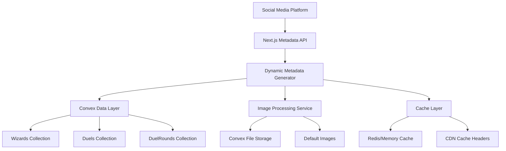

# Design Document

## Overview

This design implements comprehensive social media metadata (Open Graph and Twitter Cards) for the AI Wizard Duel application to create rich, engaging previews when users share wizard profiles and duel links on social media platforms. The solution leverages Next.js's built-in metadata API and dynamic route generation to provide optimized social sharing experiences.

## Architecture

### High-Level Architecture



### Component Architecture

The metadata system will be implemented using Next.js's file-based routing with dynamic metadata generation:

- **Route-level metadata**: Each dynamic route (`/wizards/[id]`, `/duels/[id]`) will have its own metadata generation
- **Centralized metadata service**: Shared utilities for consistent metadata formatting
- **Image optimization**: Leverage Convex storage URLs with proper sizing
- **Caching strategy**: Multi-layer caching for performance

## Components and Interfaces

### 1. Metadata Generation Service

**Location**: `src/lib/metadata.ts`

```typescript
interface MetadataConfig {
  title: string;
  description: string;
  image?: string;
  url: string;
  type?: "website" | "article";
}

interface WizardMetadata {
  wizard: Doc<"wizards">;
  stats?: {
    wins: number;
    losses: number;
    winRate: number;
  };
}

interface DuelMetadata {
  duel: Doc<"duels">;
  wizards: Doc<"wizards">[];
  status: "active" | "completed" | "waiting";
}
```

### 2. Dynamic Route Metadata

**Wizard Pages** (`src/app/wizards/[id]/page.tsx`):

- Generate metadata based on wizard data
- Include wizard image, name, description, and stats
- Handle missing wizards gracefully

**Duel Pages** (`src/app/duels/[id]/page.tsx`):

- Generate metadata based on duel status and participants
- Include appropriate images (round illustrations or defaults)
- Dynamic titles based on duel state

### 3. Image Processing Pipeline

**Convex Integration**:

- Utilize existing Convex file storage for wizard illustrations
- Generate optimized URLs with proper dimensions (1200x630)
- Fallback to default images when illustrations are missing

**Default Images**:

- Wizard placeholder: Enhanced version of existing default wizard image
- Duel backgrounds: Epic battle scenes for different duel states
- App logo: High-resolution social sharing image

### 4. Caching Strategy

**Server-Side Caching**:

- Cache generated metadata for 24 hours
- Invalidate cache when wizard/duel data changes
- Use Next.js built-in caching mechanisms

**CDN Caching**:

- Set appropriate cache headers for images
- Implement cache-busting for updated content

## Data Models

### Metadata Cache Schema

```typescript
interface MetadataCache {
  key: string; // wizard_id or duel_id
  type: "wizard" | "duel";
  metadata: {
    title: string;
    description: string;
    image: string;
    lastUpdated: number;
  };
  expiresAt: number;
}
```

### Image Optimization Config

```typescript
interface ImageConfig {
  width: 1200;
  height: 630;
  format: "jpeg" | "png";
  quality: 85;
  fallbackImage: string;
}
```

## Error Handling

### Graceful Degradation

1. **Missing Wizard Data**:
   - Return default metadata with app branding
   - Use placeholder wizard image
   - Generic description about the app

2. **Missing Duel Data**:
   - Return default metadata with app branding
   - Use generic duel background image
   - Standard app description

3. **Image Loading Failures**:
   - Automatic fallback to default images
   - Retry mechanism for temporary failures
   - Logging for monitoring

### Error Boundaries

- Metadata generation wrapped in try-catch blocks
- Fallback to minimal but valid metadata
- Error logging for debugging and monitoring

## Testing Strategy

### Unit Tests

1. **Metadata Generation Functions**:
   - Test wizard metadata generation with various data states
   - Test duel metadata generation for different statuses
   - Test fallback scenarios for missing data

2. **Image Processing**:
   - Test URL generation for Convex storage
   - Test fallback image selection
   - Test image dimension validation

### Integration Tests

1. **Social Media Validation**:
   - Test Open Graph metadata format
   - Test Twitter Card metadata format
   - Validate image dimensions and formats

2. **Performance Tests**:
   - Test metadata generation response times
   - Test caching effectiveness
   - Test concurrent request handling

### End-to-End Tests

1. **Social Platform Testing**:
   - Test actual sharing on Facebook (Open Graph debugger)
   - Test Twitter Card validator
   - Test Discord embed functionality
   - Test LinkedIn preview generation

2. **User Journey Tests**:
   - Test sharing wizard profiles
   - Test sharing active duels
   - Test sharing completed duels

## Implementation Details

### Next.js Metadata API Integration

Each dynamic route will implement the `generateMetadata` function:

```typescript
export async function generateMetadata({ params }: Props): Promise<Metadata> {
  const wizardId = params.id;
  const wizard = await getWizard(wizardId);

  if (!wizard) {
    return getDefaultMetadata();
  }

  return generateWizardMetadata(wizard);
}
```

### Convex Query Integration

Metadata generation will use existing Convex queries:

- `api.wizards.getWizard` for wizard data
- `api.duels.getDuel` for duel data
- `api.duels.getDuelRounds` for round illustrations

### Image URL Generation

Leverage Convex storage URLs with optimization:

- Use `ctx.storage.getUrl()` for wizard illustrations
- Implement image resizing for optimal social media dimensions
- Generate signed URLs with appropriate expiration

### Cache Implementation

Use Next.js built-in caching with custom cache keys:

- Cache wizard metadata: `wizard_metadata_${wizardId}`
- Cache duel metadata: `duel_metadata_${duelId}`
- Implement cache invalidation on data updates

## Performance Considerations

### Optimization Strategies

1. **Lazy Loading**: Generate metadata only when requested by social platforms
2. **Parallel Processing**: Fetch wizard and duel data concurrently
3. **Image Optimization**: Pre-generate optimized images for popular content
4. **CDN Integration**: Serve images through CDN for global performance

### Monitoring and Metrics

1. **Response Time Tracking**: Monitor metadata generation performance
2. **Cache Hit Rates**: Track caching effectiveness
3. **Error Rates**: Monitor fallback usage and failures
4. **Social Platform Analytics**: Track sharing engagement metrics

## Security Considerations

### Data Privacy

- Ensure only public wizard and duel data is included in metadata
- Respect user privacy settings if implemented
- Sanitize all text content to prevent XSS

### Rate Limiting

- Implement rate limiting for metadata endpoints
- Protect against scraping and abuse
- Monitor for unusual traffic patterns

## Migration and Deployment

### Rollout Strategy

1. **Phase 1**: Implement basic metadata for wizard pages
2. **Phase 2**: Add duel page metadata with dynamic content
3. **Phase 3**: Implement advanced features (cache invalidation, analytics)
4. **Phase 4**: Optimize performance and add monitoring

### Backward Compatibility

- Maintain existing page functionality
- Ensure metadata doesn't impact page load performance
- Graceful degradation for older social media platforms

## Future Enhancements

### Advanced Features

1. **Dynamic Image Generation**: Create custom social images with wizard stats
2. **A/B Testing**: Test different metadata formats for engagement
3. **Analytics Integration**: Track social sharing performance
4. **Personalization**: Customize metadata based on sharing user

### Platform-Specific Optimizations

1. **Twitter Spaces**: Enhanced metadata for Twitter integration
2. **Discord Rich Embeds**: Custom embed formatting for Discord
3. **LinkedIn Articles**: Professional formatting for LinkedIn shares
4. **WhatsApp Previews**: Optimized previews for messaging apps
